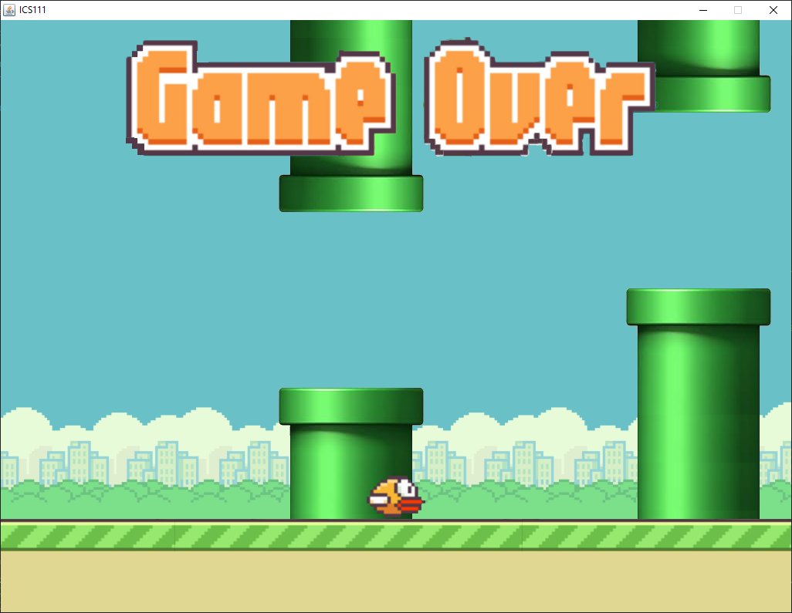

As a ICS 111 project my group re-created the classic game 'Flappy bird.'  The game had all the features of the original, flapping... well, that it, flapping.  In all seriouness however, we created a menu for the game that kept track of the current high score in a txt file and allowed the user to play again and again until their brain rots or they get bored (rated E for everyone).  

It was a challenge to work with people I had not met prior on this project and it proved to be an even bigger struggle to find something for them to do as they were even less experienced than I was.  In the end we were able to get a solid deligation of work that allowed us to get a good grade on our final project.
