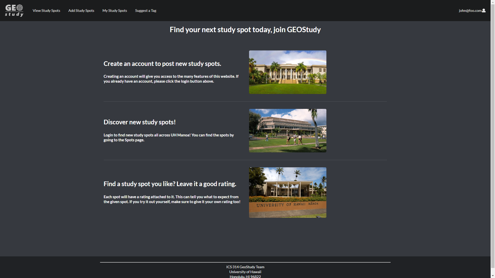

This application was created as the final project for my ICS 314 class.  We worked to together to create a database capable of storing study spots created by end users.  These study spots can also be rated and assigned tags by users.  Users also have the option of requesting the creation of new tags should they want to.  Every spot is accessible to all users to view and rate, but only the creator of a spot and admin accounts can edit or remove a listing.

More information about this project can be found here: [GeoStudy Project Page](https://geostudy.github.io/)
